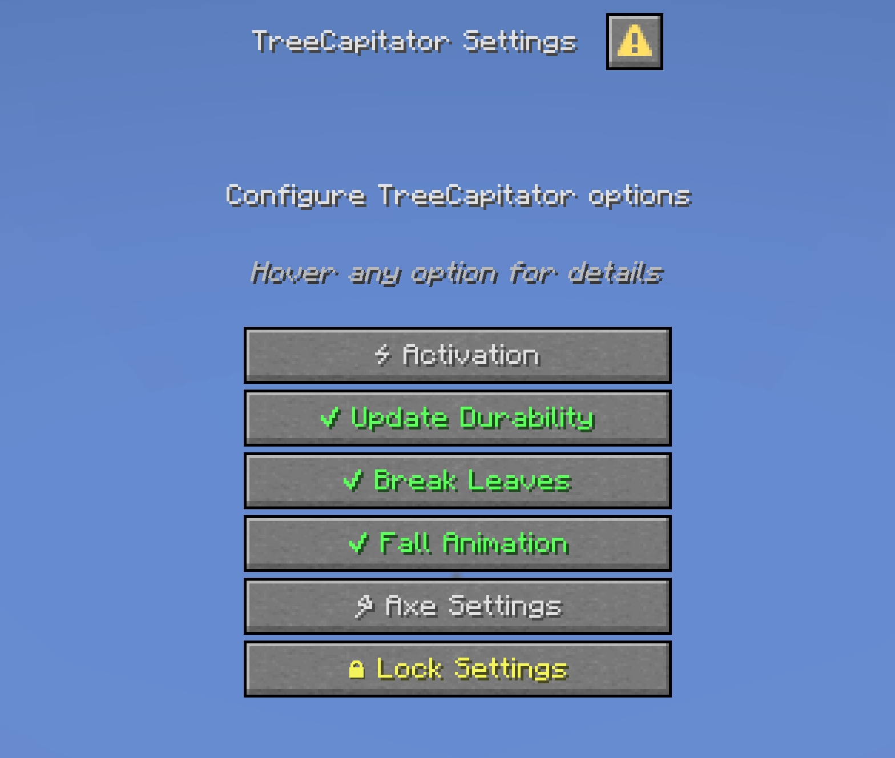

# TreeCapitator

A Minecraft data pack that fells the entire tree when you chop a single log.

## Installation

1. Download the latest release.
2. Drop the zip into your world's `datapacks` folder.
3. That's it! Enjoy!

## Usage

Press **G** to open settings, or run `/trigger TreeCapitator`.



From the main dialog you can toggle:

- **Activation** — when felling triggers (standing, sneaking, or both). Per-player.
- **Update Durability** — whether felled logs cost axe durability.
- **Break Leaves** — whether attached leaves are broken too.
- **Fall Animation** — visual log-tipping effect.
- **Axe Settings** — per-axe toggle and per-tree restrictions (see below).
- **Lock Settings** — freeze settings server-wide. OPs unlock with `/function tc:unlock`.

### Axe settings


For each axe you can enable/disable it and choose which tree types it can fell.

### Locking

When locked, only the per-player activation toggle can be changed. Everything else is read-only until an OP runs `/function tc:unlock`.

## Adding custom trees and axes

Other data packs can extend TreeCapitator by calling its register functions - no edits to TreeCapitator needed.

### Custom axe

```mcfunction
function tc:axe/register {score: "my_axe", namespace: "mymod", name: "My Axe", max_damage: 500}
```

That's it. Use-detection picks it up automatically; no predicate or tag edits required.

### Custom tree

```mcfunction
function tc:tree/register {default_enabled: 1, name: "Mahogany", block: mahogany_log, namespace: "mymod", animation_block: mahogany_wood, leaves: mahogany_leaves, diagonal_up: 1, diagonal_side: 1, stem: 0, nether: 0, max_branch: 0}
```

For your custom log/leaf blocks to be detected during felling, also extend TreeCapitator's block tags from your addon pack — Minecraft merges tags across packs:

- `data/tc/tags/block/logs.json` — your log blocks
- `data/tc/tags/block/leaves.json` — your leaf blocks
- `data/tc/tags/block/nether_logs.json` — for nether-style logs
- `data/tc/tags/block/nether_leaves.json` — for nether-style leaves

## Building from source

1. Clone this repo and open a terminal in it.
2. `npm i` to install dependencies.
3. Edit `watch-changes.js` — set `datapacksFolder` to your world's `datapacks` folder.
4. `npm start` — syncs files live as you edit.
